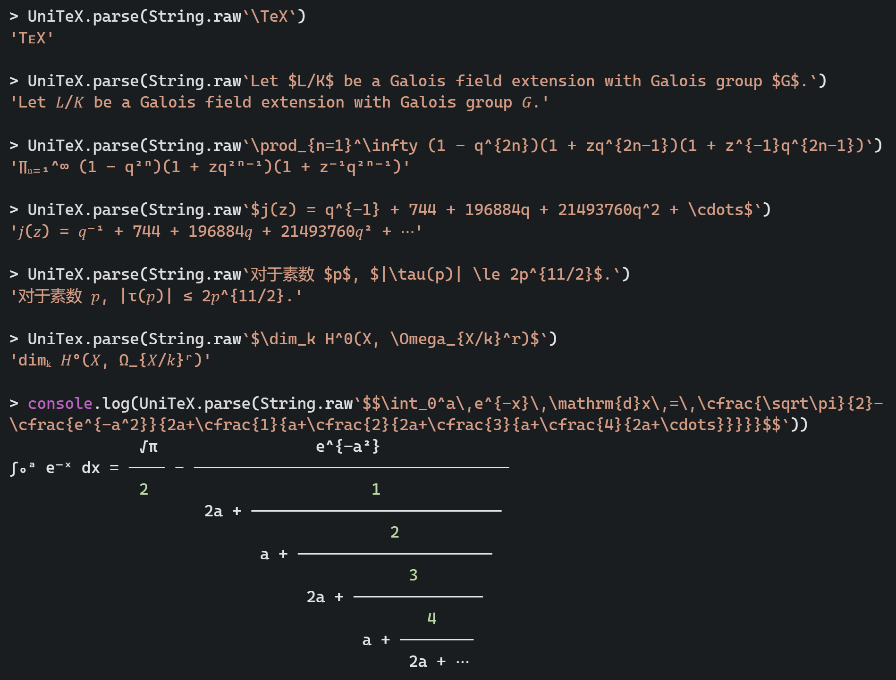

# UniTeX
A transpiler that converts TeX into Unicode (as possible). 

## Usage
```js
UniTeX.parse(source: string)
```

## Example


- text formula
  > ℓ(D) - ℓ(K_C-D) = deg D - g + 1 
    &emsp; `\ell(D) - \ell(K_C-D) = deg D - g + 1`

- inline formula
  > 𝐸[𝑚] ≃ ℤ/𝑚ℤ × ℤ/𝑚ℤ, Gal(𝐾̄/𝐾) → Aut(𝐸[𝑚])
    &emsp; `$E[m] \simeq \Z/m\Z \times \Z/m\Z, \text{Gal}(\bar K/K) \rarr \text{Aut}(E[m])$`

- block formula
  ```
       aτ + b                   
    f(--------) = (cτ + d)ᵏ f(τ)
       cτ + d                   
  ``` 
&emsp; `$$f(\frac{a\tau+b}{c\tau+d})\,=\,(c\tau+d)^k\,f(\tau)$$`

## TODO

- **Some basic or commonly used macro commands**. ideally including but not limited to the functions in [MathJax](https://www.mathjax.org/) and [KaTeX](https://katex.org), They have some differences in the supported macros. This project will prefer the latter design (i.e. [Supported Functions](https://katex.org/docs/supported.html)).
  - [ ] Fixed
    - [x] Greek Letters
    - [ ] Unicode Block 79 : Mathematical Operators
      - [x] 220x ~ 226x
      - [ ] 227x ~ 22Fx 
    - [x] Delimiters
    - [x] Arrows
    - [x] Operators
      - [x] Big Operators
      - [x] Operator Names
      - [x] Combined Operator Names
    - [x] Theorem Environment
    - [ ] Vertical Layout
    - [x] Spacing
  - [ ] Unary
    - [ ] Accents (hard)
    - [x] Font Family
    - [ ] Extensible Arrows
    - [x] Optionals (sqrt)
  - [ ] Binary
    - [x] Relations Operators
    - [x] Fractions (inline)
    - [x] (**cmdline only**) Fractions (block)
    - [ ] Binomials
  - [ ] Environments
    - [x] Matrix (inline)
    - [ ] (**cmdline only**) Matrix (block)
    - [x] Typeface (math env)
    - [x] Typesetting (block)
    - [ ] Array
    - [ ] Align Family
    - [ ] (**cmdline only**) AMScd
    - [ ] (**cmdline only**) Tikzcd (hard)
  - [ ] Macros
    - [ ] Def
    - [ ] Command

- **A [website](https://unitex-web.netlify.app) convenient for input and output**. [Source code repository](https://github.com/kokic/UniTeX-Website).

- **Additional unicode characters** and corresponding macro commands ([BabelMap](https://www.babelstone.co.uk/Unicode/babelmap.html)). This is mainly for the macro commands that exist in the common packages of TeX, which are not implemented by KaTeX or MathJax but are supported by Unicode.

- **Various Tables**. 
Although UniTeX faces similar problems <sup><a id='tables-packages-back' href='#tables-packages'>[1]</a></sup>, it is much easier to implement for UniTeX (e.g. [zeich.hs](https://github.com/kokic/dynastes/blob/main/zeich.hs)), the really important problem is the font, because the unique spacing of the non-monospace (equal width) font may cause the elements such as the border to not be aligned, but this is completely determined by the user or the platform it is displayed on therefore, users can only be advised to use monospace-like fonts <sup><a id='tables-remedies-back' href='#tables-remedies'>[2]</a></sup>. 

- **Multiline Structure**. 

## Future

- **The output is syntactically compatible with [AsciiMath](http://asciimath.org)**, which may be used as the default style or an optional setting. 

- **Terminal versions (in other languages)**. It is suitable for some environments with high performance requirements, so the JVM family (Java, Kotlin, etc.) or Rust will be given priority in language selection. 

<!-- ## Demo -->

<!-- ## Documentation -->

---

## Development

- node.js

## Build (for Browser)

- node.js
- webpack

```
webpack ./unitex.js --mode=none --output-library-type=window
```

--- 

<a id='tables-packages' href='#tables-packages-back'>[1].</a>
Perhaps due to the complexity of macro packages itself in history, KaTeX does not support any form of table environment at present (of course, the array environment is sufficient for some simple cases, so it is not a big problem for KaTeX from the perspective of basic functions). 

<a id='tables-remedies' href='#tables-remedies-back'>[2].</a>
There may be some remedies, it is conceivable that they are not completely effective.

<!-- ## Acknowledge -->

